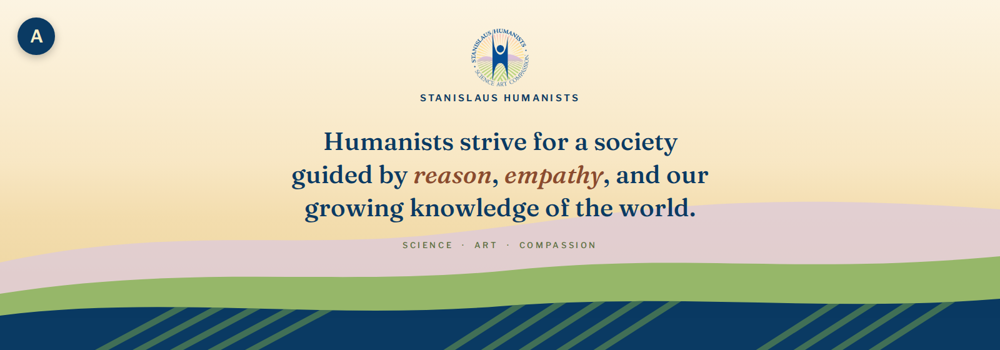
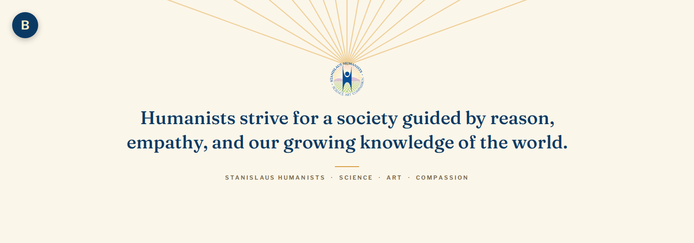
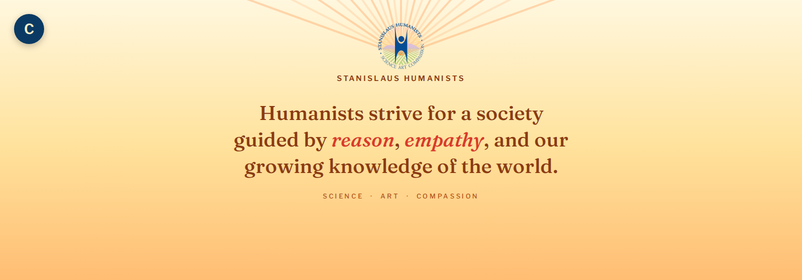
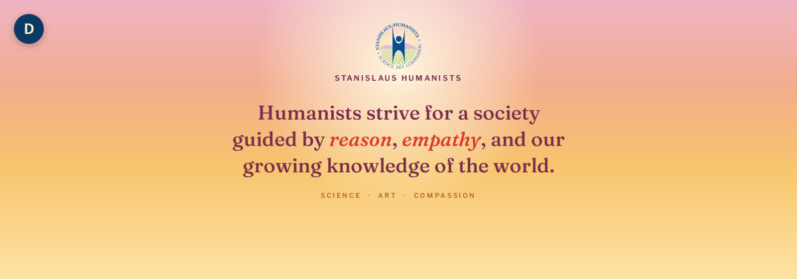
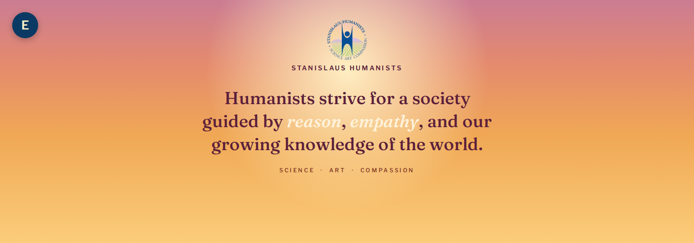
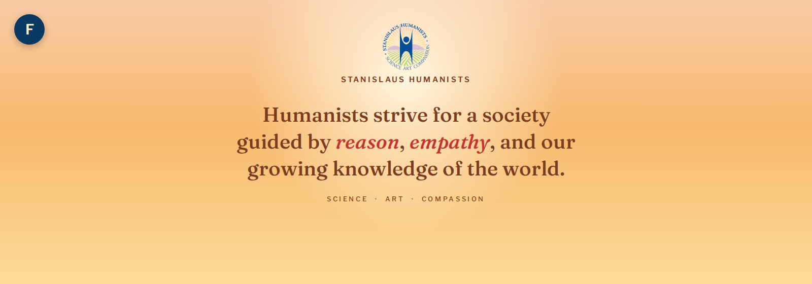
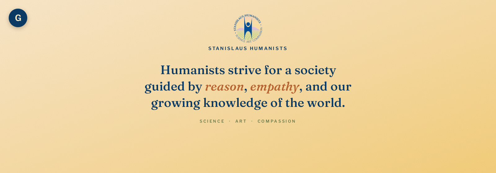
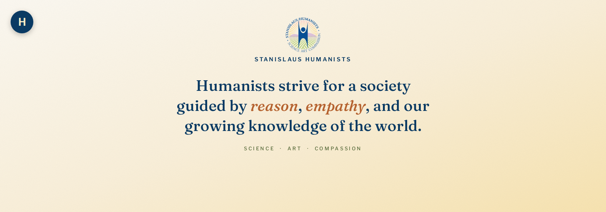

# Stanislaus Humanists — Header Concepts

Draft header/hero images for **stanislaus-humanists.org**, built around the site's quote:

> "Humanists strive for a society guided by reason, empathy, and our growing knowledge of the world."

All images are 1600×560px. Typefaces: **Fraunces** (serif, quote) + **Libre Franklin** (tracked sans, labels). Logo used as-is from the org's site. Each image carries a letter badge in the corner — refer to concepts by letter (e.g. "I like B best, followed by C").

## A — Vineyard Horizon (front-runner)

Warm cream-to-gold sky over layered hills echoing the logo's vineyard rows, with the quote in navy Fraunces and *reason* / *empathy* picked out in terracotta italic.

## B — First Light

Minimal cream background, faint dawn rays fanning from behind the logo. Liked for its brighter, happier feeling.

## C — Citrus Sky

Warm gold-to-peach gradient with orange sunburst rays, no hills.

## D — Dawn Sky

Soft pink-to-gold sunrise gradient with a glow behind the logo, no rays, no hills.

## E — Rose Gold Dawn

Deeper rose-to-amber sunrise gradient. **Known issue:** the cream accent color on "reason / empathy" is low-contrast against the mid-orange background — needs a fix if this direction is pursued.

## F — Amber Blush

Gentlest golden-morning gradient — apricot to gold only, least dramatic of the sunrise set.

## G — Brand Gold (V2 style)

Soft medium gold diagonal gradient anchored to the logo's actual sunburst gold (`#FCD884`), with a subtle paper-grain texture. Matches the "V2" reference gradient provided.

## H — Brand Gold (V3 style)

Palest, airiest version of the same brand-gold gradient. Matches the "V3" reference gradient provided.

---

Built with HTML/CSS + Playwright (Chromium headless) rendering to PNG. Source templates are not included in this repo — only the rendered concepts.
